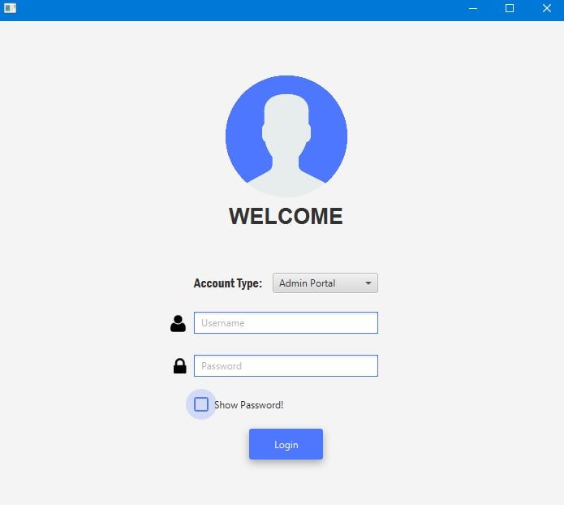
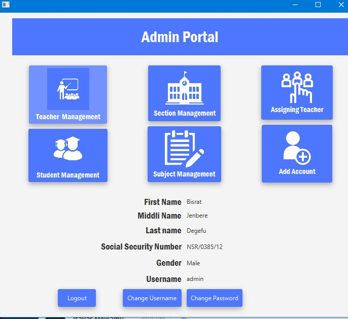
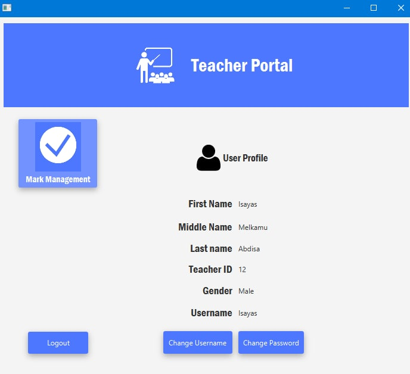
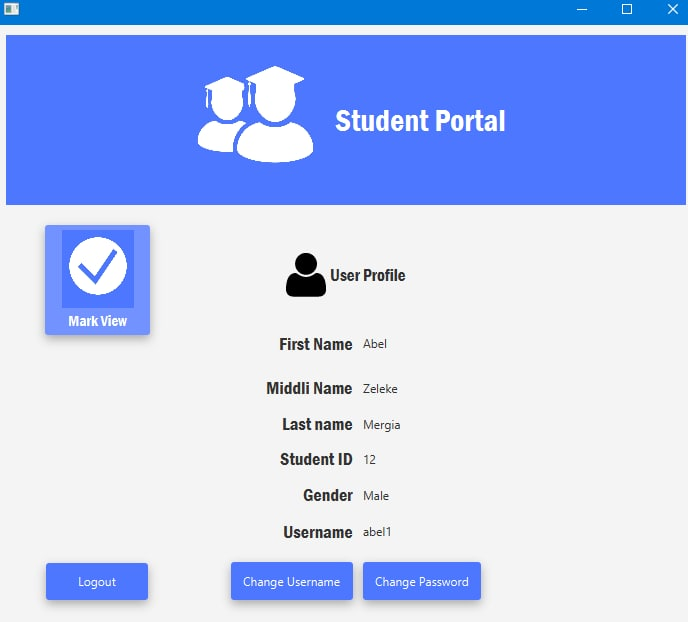
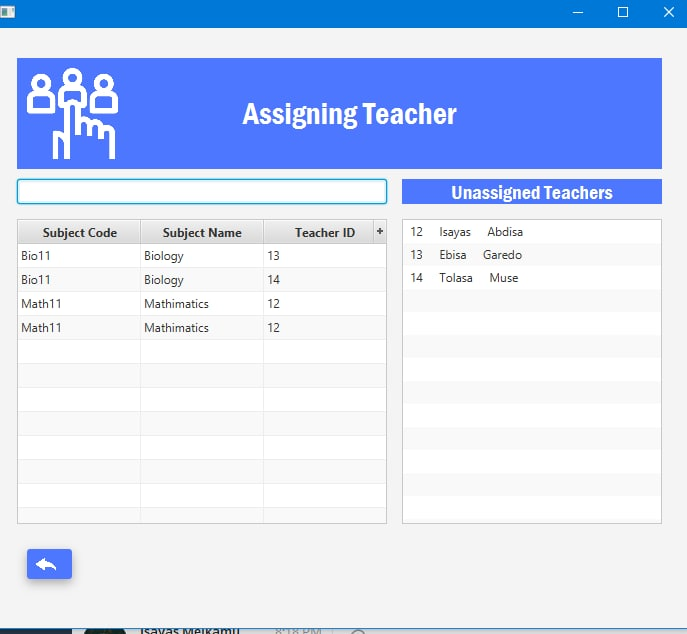

### School Management System JavaFX

---

## 👉 Requirements

- JDK - 17.0.2
- JavaFX SDK - 17.0.2
- fontawesomefx-8.1
- jfoenix-17.0.2
- mysql-connector-java-8.0.29

## vmArgs Setup

```
----module-path \"E:\\Application\\Java Material\\javafx-sdk-17.0.2\\lib\" --add-modules javafx.controls,javafx.fxml

```

👉 Sample screenshots taken

<br>

<br>

<br>

<br>

<br>
